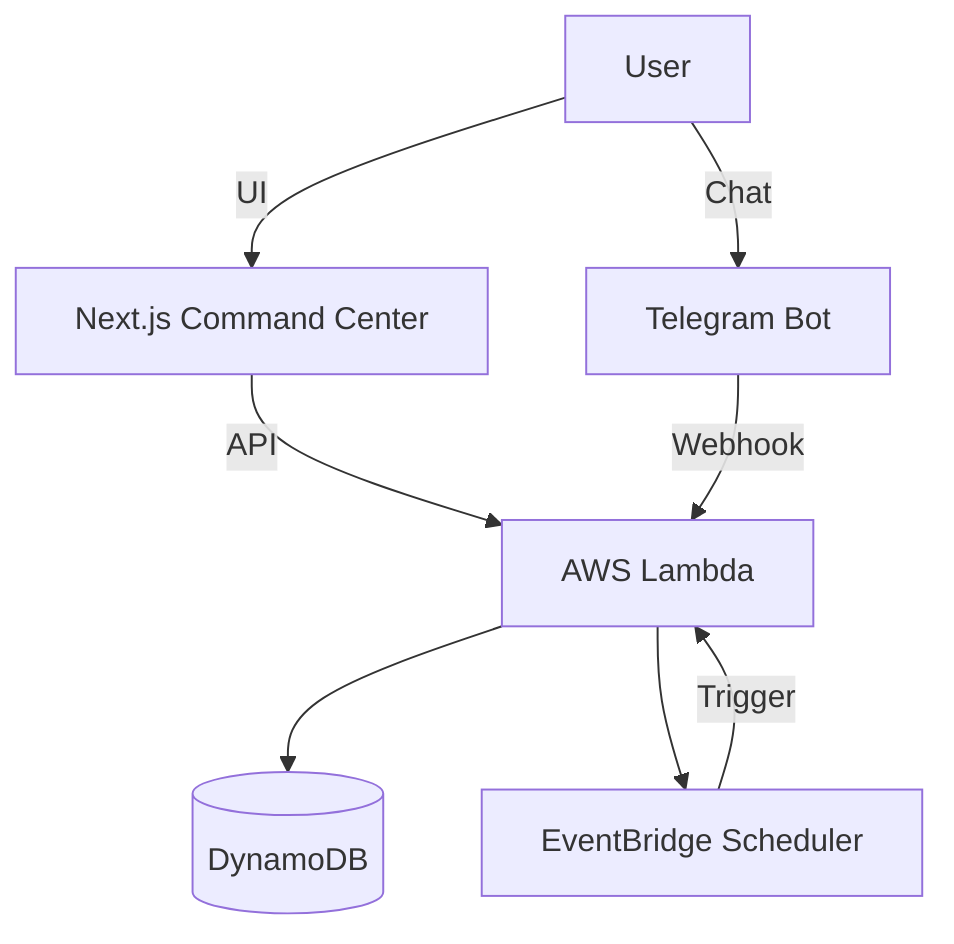

# 🧠 External Brain (Personal Assistant)

A "Cyber-Zen" productivity system designed to offload mental clutter. It combines a sleek Next.js Command Center with a robust AWS serverless backend and a Telegram bot that nags you until you get things done.

 
*(Replace with actual screenshot)*

## ✨ Key Features

### 1. 🎛️ Command Center (Frontend)
- **Cyber-Zen UI**: A beautiful, dark-mode interface built with Next.js, Tailwind CSS, and Framer Motion.
- **Task Management**: Create, edit, and delete tasks. Supports recurring tasks (Daily, Weekly).
- **Analytics**:
    - **🔥 Streak Counter**: Tracks your daily consistency.
    - **🗺️ Consistency Heatmap**: A GitHub-style visualization of your productivity over time.
- **Responsive**: Works perfectly on desktop and mobile.

### 2. 🤖 The Backend (AWS Serverless)
- **AWS Lambda**: Handles all logic (Task Scheduling, Webhooks, Reporting).
- **Amazon DynamoDB**: Stores tasks, templates, and user stats.
- **Amazon EventBridge**: Powers the scheduler (cron jobs) and the "Chase" logic.

### 3. 📱 Telegram Bot Integration
- **NagBot**: Sends reminders when tasks are due.
- **Interactive Actions**:
    - `Done ✅`: Completes the task.
    - `Snooze 💤`: Snoozes for a set time (and reschedules the chase!).
    - `Skip ⏭️`: Moves the task to tomorrow.
- **"Chase" Logic**: If you ignore a notification, the system schedules a follow-up "Chase" event to ensure you don't forget.
- **Weekly Reports**: Every Monday at 9 AM, get a summary of your streak and completion rate.

## 🛠️ Architecture



## 🚀 Setup Guide

### Prerequisites
- Node.js & npm
- AWS Account (Free Tier is sufficient)
- Telegram Bot Token (from @BotFather)

### 1. Clone & Install
```bash
git clone https://github.com/yourusername/external-brain.git
cd external-brain
npm install
```

### 2. Backend Deployment (AWS)
Navigate to the `backend` folder and run the deployment script (requires AWS credentials configured):
```bash
cd backend
node scripts/deploy-lambdas.js
```
This will create/update the Lambda functions and DynamoDB tables.

### 3. Frontend Setup
Navigate to the `command-center` folder:
```bash
cd command-center
npm install
npm run dev
```
Create a `.env.local` file with your AWS credentials:
```env
AWS_ACCESS_KEY_ID=your_key
AWS_SECRET_ACCESS_KEY=your_secret
AWS_REGION=ap-south-1
DYNAMODB_TABLE_NAME=PersonalAssistant_Tasks
```

### 4. Telegram Webhook
Set up your Telegram bot webhook to point to the `WebhookHandler` Lambda function URL.

## 🤝 Contributing
Feel free to fork and improve! 

## 📄 License
MIT
